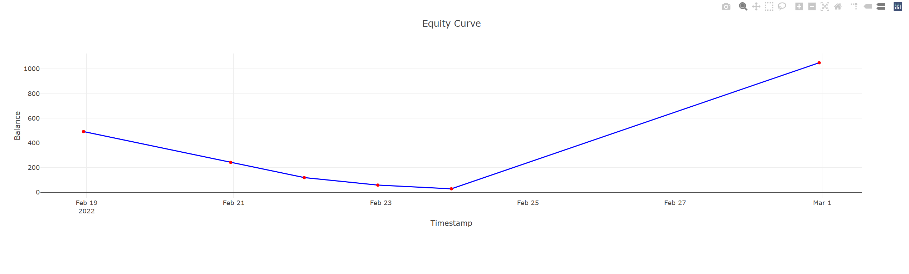

# BackMark Plotter


Small lib to Plot [Backmark](https://www.npmjs.com/package/backmark) Trades with Plotty.js as an HTML output file

## Installation

```
 npm i back-mark-plotter
```

## Usage Example

```ts
import { expect } from 'chai';
import { TradePlotter } from '../src/index.js';
import path from 'path';
import { SmaStrategy } from './strategies/smaStrategy.js';

async function plotExample(){
    const options = {
        accountBalance: 1000,
        fee: 1.5,
        productName: 'BTC-USD',
    };
    const backTest = new BackTest('./test/data/btcusd_short.csv', SmaStrategy, options);

    await backTest.run();

    const result = backTest.getResult();

    const plotter = new TradePlotter(result.tradeHistory);

    plotter.plot();
}
```
A *trades_plot.html* file output will be generated.

Example:


